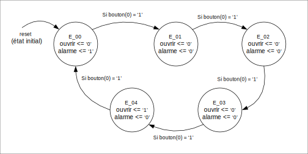

# Le cadenas à switch

----------------------------------------------------------------------------------------------
## Partie 0 : une machine à états de base

Les fichiers suivants sont  fournis pour aider à contrôler les interfaces de la carte et faire l'implémentation dans le FPGA. Ne les modifiez pas.
- [utilitaires_inf3500_pkg.vhd](sources/utilitaires_inf3500_pkg.vhd) : pour regrouper un ensemble de fonctions utiles pour les laboratoires du cours;
- [generateur_horloge_precis.vhd](sources/generateur_horloge_precis.vhd) : pour générer une horloge à une fréquence désirée à partir de l'horloge de la carte;
- [monopulseur.vhd](sources/monopulseur.vhd) : pour synchroniser les actions des humains avec l'horloge du système;
- [top_labo_3.vhd](sources/top_labo_3.vhd) : pour regrouper tous les fichiers lors de l'implémentation;
- [basys_3_top.xdc](xdc/basys_3_top.xdc), [nexys_a7_50t_top.xdc](xdc/nexys_a7_50t_top.xdc) et [nexys_a7_100t_top.xdc](xdc/nexys_a7_100t_top.xdc) : trois fichiers correspondant à trois cartes de développement différentes, pour établir des liens entre des identificateurs et des pattes du FPGA; et,
- [labo_3_synth_impl.tcl](synthese-implementation/labo_3_synth_impl.tcl) : pour regrouper les commandes à utiliser pour faire l'implémentation.

### La machine à états et son code VHDL

Une machine à états de base vous est fournie dans le fichier [cadenas_labo_3.vhd](sources/cadenas_labo_3.vhd). La machine à états de base correspond au diagramme d'états suivant.

### Implémentation et programmation de la carte

Suivez les étapes suivantes pour faire la synthèse et l'implémentation du code sur votre carte :

1. Lancez une fenêtre d'invite de commande (`cmd` sous Windows) et naviguez au répertoire `\inf350\labo-3\synthese-implementation\`.
2. De ce répertoire, lancez Vivado en mode script avec la commande 
`{repertoire-d-installation-d-Vivado}\bin\vivado -mode tcl` où {repertoire-d-installation-d-Vivado} est probablement C:\Xilinx\Vivado\2021.1 si votre système d'exploitation est Windows.
3. Dans la fenêtre, à l'invite de commande `Vivado%`, entrez les commandes contenues dans le fichier [labo_3_synth_impl.tcl](synthese-implementation/labo_3_synth_impl.tcl). Si votre carte n'est pas une Basys 3, vous devrez commenter certaines lignes et en dé-commenter d'autres qui correspondent à votre carte.

Pour l'étape 2: Faite cette commande `repertoire-d-installation-d-Vivado}\bin\vivado -mode tcl -script labo_3_synth_impl.tcl`, pour laisser le script faire toutes les étapes

Faites la synthèse et l'implémentation de votre module pour votre carte. Vérifiez-en le fonctionnement.

## Références pour creuser plus loin

Les liens suivants ont été vérifiés en septembre 2021.

- Tous les manuels de Xilinx :  <https://www.xilinx.com/products/design-tools/vivado/vivado-ml.html#documentation>
- Vivado Design Suite Tcl Command Reference Guide : <https://www.xilinx.com/content/dam/xilinx/support/documentation/sw_manuals/xilinx2021_1/ug835-vivado-tcl-commands.pdf>
- Vivado Design Suite User Guide - Design Flows Overview : <https://www.xilinx.com/support/documentation/sw_manuals/xilinx2020_2/ug892-vivado-design-flows-overview.pdf>
- Vivado Design Suite User Guide - Synthesis : <https://www.xilinx.com/support/documentation/sw_manuals/xilinx2020_2/ug901-vivado-synthesis.pdf>
- Vivado Design Suite User Guide - Implementation : <https://www.xilinx.com/support/documentation/sw_manuals/xilinx2020_2/ug904-vivado-implementation.pdf>

- Ce projet est basé sur le code du labo_3 du cours INF3500 automne 2023 fait par le Département du Génie informatique et Logiciel de Polytechnique Montréal
